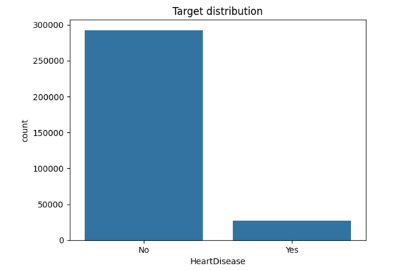
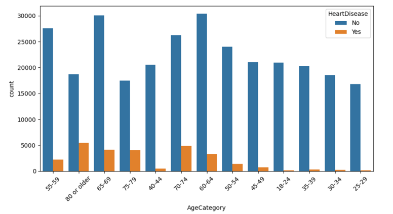
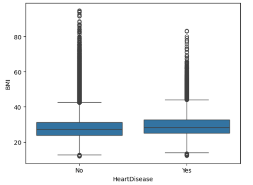

# Отчёт по проекту

**Студент:** Мальцева Виктория  
**Группа:** БИВ238

---

## 1. Введение и постановка задачи

### Цель проекта

Разработать модель машинного обучения для предсказания наличия сердечно-сосудистых заболеваний у пациентов на основе клинических и поведенческих факторов.

### Практическая ценность

Сердечно-сосудистые заболевания являются одной из основных причин смертности в мире. Раннее выявление пациентов группы риска позволяет своевременно начать профилактику и лечение, что снижает риск развития тяжёлых осложнений и спасает жизни. Разработанная модель может использоваться в системах поддержки принятия врачебных решений и для первичного скрининга населения.

### Формулировка задачи

**Тип задачи:** Бинарная классификация

**Входные данные:** клинические и поведенческие признаки пациента (возраст, пол, индекс массы тела, курение, диабет, физическая активность и др.)

**Выход:** предсказание — есть ли у пациента сердечно-сосудистое заболевание (Yes/No)

### Обоснование метрики качества

В данной задаче используется **две ключевые метрики**:

| Метрика | Приоритет | Обоснование |
|---------|-----------|-------------|
| **ROC-AUC** | Основная | Позволяет оценить способность модели разделять классы при сильном дисбалансе (91% здоровых, 9% больных) |
| **Recall** | Важная (медицинская) | Показывает долю больных пациентов, которых модель правильно выявила. В медицине **важнее не пропустить больного**, чем ошибиться на здоровом |

**Компромисс:** Если приходится выбирать между Recall и Precision, приоритет отдаётся Recall — лучше направить здорового на дополнительное обследование (ложная тревога), чем пропустить больного (пропущенный диагноз).

---

## 2. Поиск и описание данных

### Источник данных

**Название:** Personal Key Indicators of Heart Disease  
**Платформа:** Kaggle  
**Ссылка:** https://www.kaggle.com/datasets/kamilpytlak/personal-key-indicators-of-heart-disease

**Почему выбран:** датасет содержит большой объём реальных медицинских данных, подходит для задачи классификации, содержит дисбаланс классов, что позволяет отработать навыки балансировки.

### Описание датасета

| Характеристика | Значение |
|----------------|----------|
| Количество строк | 119,759 |
| Количество столбцов (исходных) | 18 |
| Целевая переменная | HeartDisease (Yes/No) |
| Дисбаланс классов | 91.2% здоровых, 8.8% больных |

### Описание признаков

| Признак | Тип | Описание |
|---------|-----|----------|
| BMI | float | Индекс массы тела |
| Smoking | object | Курение (Yes/No) |
| AlcoholDrinking | object | Употребление алкоголя |
| Stroke | object | Инсульт в анамнезе |
| PhysicalHealth | float | Дней с плохим физическим здоровьем (0-30) |
| MentalHealth | float | Дней с плохим психическим здоровьем (0-30) |
| DiffWalking | object | Трудности при ходьбе |
| Sex | object | Пол (Male/Female) |
| AgeCategory | object | Возрастная категория (13 категорий) |
| Race | object | Раса |
| Diabetic | object | Диабет |
| PhysicalActivity | object | Физическая активность |
| GenHealth | object | Общее состояние здоровья |
| SleepTime | float | Часов сна в сутки |
| Asthma | object | Астма |
| KidneyDisease | object | Болезнь почек |
| SkinCancer | object | Рак кожи |

---

## 3. Обработка и подготовка данных

### Полная очистка

**Пропуски:**

| Признак | Количество пропусков | Стратегия |
|---------|---------------------|-----------|
| SleepTime | 1 | Заполнение медианой (7.0) |
| Sex, AgeCategory, Race, Diabetic, PhysicalActivity, GenHealth, Asthma, KidneyDisease, SkinCancer | по 1 | Заполнение модой (наиболее частым значением) |

**Итог:** все пропуски заполнены, потеря данных отсутствует.

**Дубликаты:**

- Обнаружено: 3,006 дубликатов
- Стратегия: полное удаление

**Выбросы:**

| Признак | IQR метод | Выбросов | Решение |
|---------|-----------|----------|---------|
| BMI | 12.50–42.70 | 3,672 (3.07%) | Не удалялись (могут быть клинически значимы) |
| PhysicalHealth | -3.0–5.0 | 18,041 (15.06%) | Не удалялись (нормальные значения 0–30) |
| MentalHealth | -4.5–7.5 | 19,260 (16.08%) | Не удалялись |
| SleepTime | 3.0–11.0 | 1,817 (1.52%) | Не удалялись |

**Вывод по выбросам:** выбросы не удалялись, так как они могут соответствовать реальным клиническим случаям (ожирение при BMI > 40, гиперсомния при SleepTime > 12 и т.д.).

**Типы данных:** приведены к корректным типам (числовые → float, категориальные → object).

### Feature engineering (создание новых признаков)

| Признак | Формула | Обоснование |
|---------|---------|-------------|
| `Age_num` | Маппинг AgeCategory в числа | Для использования в моделях |
| `Obesity` | BMI > 30 | Индикатор ожирения — известный фактор риска |
| `RiskFactor` | Smoking_Yes + Diabetic_Yes + PhysicalActivity_No | Суммарная оценка факторов риска |
| `Age_BMI` | Age_num × BMI | Учёт комбинированного эффекта возраста и ожирения |

**Исходное количество признаков:** 18  
**После feature engineering и one-hot encoding:** 41 признак

### Визуализации

#### Распределение целевой переменной



**Вывод:** сильный дисбаланс классов (9:1), что объясняет низкий Recall у стандартных моделей.

#### Зависимость заболевания от возраста



**Вывод:** вероятность заболевания значительно растёт с возрастом, особенно после 50 лет.

#### BMI vs Disease



**Вывод:** у больных в среднем выше индекс массы тела.

### Сплит данных

| Параметр | Значение |
|----------|----------|
| Train/Test split | 80% / 20% |
| Стратификация | По целевой переменной (stratify=y) |
| random_state | 42 (фиксирован для воспроизводимости) |

**Как избегали data leakage:**

1. **Stratified split** — сохранение пропорции классов
2. **Scale после split** — `scaler.fit()` только на train данных
3. **Feature engineering до split** — новые признаки созданы без использования целевой переменной
4. **Нет временных признаков** — риск отсутствует

---

## 4. Baseline-модель

**Модель:** Logistic Regression (без feature engineering, без балансировки)

**Результаты на тестовой выборке:**

| Метрика | Значение |
|---------|----------|
| Accuracy | 0.9111 |
| Precision | 0.5224 |
| Recall | 0.1060 |
| F1-score | 0.1762 |
| ROC-AUC | 0.8339 |

**Цель baseline:** получить точку отсчёта для сравнения. Baseline показывает высокую точность (accuracy) из-за дисбаланса классов, но очень низкий Recall (модель почти не находит больных пациентов).

---

## 5. Эксперименты

### Эксперимент 1: Балансировка классов

| | |
|---|---|
| **Гипотеза** | Добавление `class_weight="balanced"` увеличит Recall |
| **Как проверялось** | LogisticRegression с `class_weight="balanced"` |
| **Результат** | Recall вырос с 0.106 до 0.779 (рост в 7.3 раза) |

### Эксперимент 2: Сравнение моделей (без балансировки)

| | |
|---|---|
| **Гипотеза** | Ансамблевые методы лучше捕捉 нелинейные зависимости |
| **Как проверялось** | Обучены RandomForest, GradientBoosting, KNN |
| **Результат** | Gradient Boosting показал лучший ROC-AUC (0.8341) |

### Эксперимент 3: Оптимизация гиперпараметров

| | |
|---|---|
| **Гипотеза** | Подбор параметров улучшит качество Random Forest |
| **Как проверялось** | GridSearchCV с параметрами: n_estimators: [100,200], max_depth: [10,20,None], min_samples_split: [2,5] |
| **Результат** | Лучшие параметры: max_depth=10, min_samples_split=5, n_estimators=200; ROC-AUC улучшился с 0.7961 до 0.8215 |

### Таблица экспериментов

| Модель | Гипотеза | Параметры | ROC-AUC | Recall | Комментарий |
|--------|----------|-----------|---------|--------|-------------|
| Logistic Regression (baseline) | Простая модель | default | 0.8339 | 0.1060 | Низкий Recall |
| **LogReg_balanced** | Балансировка повысит Recall | class_weight="balanced" | 0.8340 | **0.7790** | ✅ Лучший Recall |
| Gradient Boosting | Ансамбль лучше捕捉 зависимости | default | **0.8341** | 0.0864 | Лучший ROC-AUC |
| Random Forest | Ансамбль лучше捕捉 зависимости | default | 0.7961 | 0.0840 | — |
| Random Forest (GridSearch) | Оптимизация улучшит качество | max_depth=10, min_samples_split=5, n_estimators=200 | 0.8215 | 0.0840 | ROC-AUC +2.5% |
| KNN | Простой метод | k=5 | 0.7098 | 0.1313 | Худший ROC-AUC |

---

## 6. Финальная модель и интерпретируемость

### Выбор финальной модели

**Финальная модель:** Logistic Regression с `class_weight="balanced"`

**Обоснование выбора:**

| Критерий | Значение | Почему важно |
|----------|---------|--------------|
| Recall | **0.779** | Выявляет 78% больных — критически важно для медицины |
| ROC-AUC | 0.834   | На уровне лучших моделей |
| Простота интерпретации |       | Коэффициенты показывают влияние каждого фактора |
| Скорость |         | Быстрое обучение и предсказание |

### Интерпретируемость

#### Важность признаков (Random Forest)

| № | Признак | Важность | Интерпретация |
|---|---------|----------|---------------|
| 1 | **Age_BMI** | 19.5% | Взаимодействие возраста и ожирения |
| 2 | **BMI** | 17.8% | Ожирение — фактор риска |
| 3 | **SleepTime** | 8.9% | Нарушения сна связаны с болезнями сердца |
| 4 | **PhysicalHealth** | 6.2% | Плохое физическое здоровье |
| 5 | **MentalHealth** | 5.3% | Плохое психическое здоровье |

#### Коэффициенты логистической регрессии (топ-5)

| № | Признак | Коэффициент | Влияние на риск |
|---|---------|-------------|-----------------|
| 1 | Age_num | 0.875 |  Сильно увеличивает риск |
| 2 | GenHealth_Fair | 0.481 |  Удовлетворительное здоровье |
| 3 | GenHealth_Good | 0.477 |  Хорошее здоровье (хуже отличного) |
| 4 | Sex_Male | 0.375 |  Мужской пол → риск выше |
| 5 | GenHealth_Poor | 0.365 |  Плохое здоровье |

#### Общие выводы по важности признаков

- **Возраст и ожирение** — два самых важных фактора риска
- **Созданный признак Age_BMI** оказался самым информативным (19.5%)
- **Пол (мужской)** и **общее состояние здоровья** также значимо влияют на риск
- Результаты соответствуют современным медицинским представлениям

---

## 7. Деплой

### API сервис

API сервис реализован на **FastAPI**.

**Доступные эндпоинты:**

| Метод | Эндпоинт | Описание |
|-------|----------|----------|
| GET | `/` | Проверка статуса сервиса |
| GET | `/health` | Health check |
| POST | `/predict` | Предсказание риска по данным пациента |

### Запуск сервера

```bash
uvicorn src.main:app --reload
```

### Пример запроса
```
{
  "BMI": 28.5,
  "Smoking": "Yes",
  "AlcoholDrinking": "No",
  "Stroke": "No",
  "PhysicalHealth": 5,
  "MentalHealth": 2,
  "DiffWalking": "No",
  "Sex": "Male",
  "AgeCategory": "55-59",
  "Race": "White",
  "Diabetic": "No",
  "PhysicalActivity": "Yes",
  "GenHealth": "Very good",
  "SleepTime": 7,
  "Asthma": "No",
  "KidneyDisease": "No",
  "SkinCancer": "No"
}
```

### Пример ответа

```
{
  "prediction": 1,
  "probability": 1,
  "message": "ВЫСОКИЙ РИСК"
}
```

#### Скриншоты приведены в папке images, видео-демонстрация - файл video.mov

## Вывод

Разработанная модель успешно решает задачу выявления пациентов с высоким риском сердечно-сосудистых заболеваний. Балансировка классов доказала свою критическую важность для медицинских задач с сильным дисбалансом. Финальная модель (Logistic Regression с class_weight="balanced") показывает оптимальный компромисс между выявлением больных (Recall = 0.779) и общим качеством (ROC-AUC = 0.834).